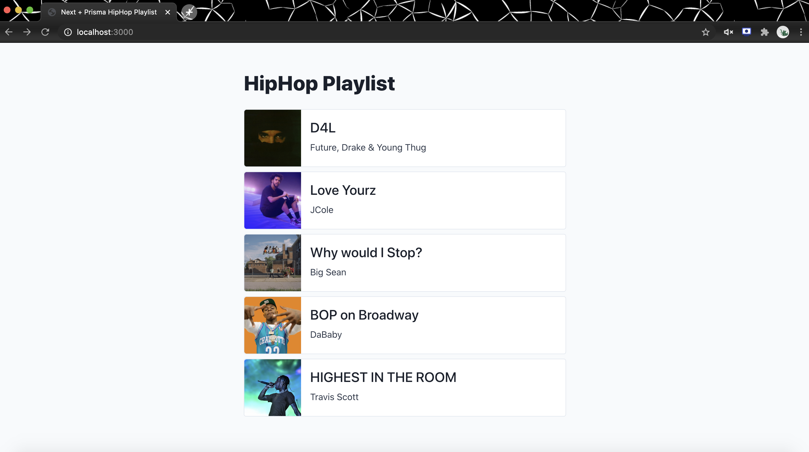
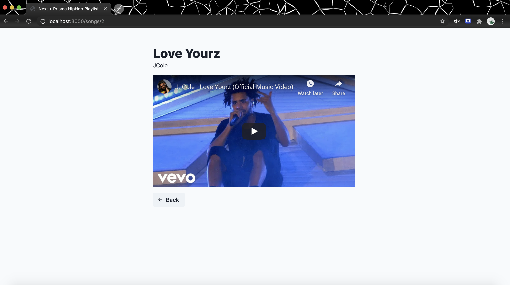

This is a playlist [Next.js](https://nextjs.org/) project.

## Application Screens




## Getting Started

First, run the development server:

```bash
npm run dev
# or
yarn dev
```

Open [http://localhost:3000](http://localhost:3000) with your browser to see the result.

You can start editing the page by modifying `pages/index.js`. The page auto-updates as you edit the file.

## Static Site Generation

```bash
npm run build
```

## Export Static Site bundle

```bash
npm run export
```

Then you can get the static website resources from the 'out' folder.

## When should I use getStaticProps?

- The data required to render the page is available at build time ahead of a user’s request.
- The data comes from a headless CMS.
- The data can be publicly cached (not user-specific).
- The page must be pre-rendered (for SEO) and be very fast — getStaticProps generates HTML and JSON files, both of which can be cached by a CDN for performance.
